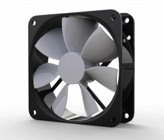

<!-- Improved compatibility of back to top link: See: https://github.com/othneildrew/Best-README-Template/pull/73 -->
<a id="readme-top"></a>
<!--
*** Thanks for checking out the Best-README-Template. If you have a suggestion
*** that would make this better, please fork the repo and create a pull request
*** or simply open an issue with the tag "enhancement".
*** Don't forget to give the project a star!
*** Thanks again! Now go create something AMAZING! :D
-->


<!-- PROJECT SHIELDS -->
<!--
*** I'm using markdown "reference style" links for readability.
*** Reference links are enclosed in brackets [ ] instead of parentheses ( ).
*** See the bottom of this document for the declaration of the reference variables
*** for contributors-url, forks-url, etc. This is an optional, concise syntax you may use.
*** https://www.markdownguide.org/basic-syntax/#reference-style-links
-->
[![Contributors][contributors-shield]][contributors-url]
[![Issues][issues-shield]][issues-url]
[![project_license][license-shield]][license-url]
[![Saad's LinkedIn][linkedin-shield]][saad-linkedin-url]
[![Tom's LinkedIn][linkedin-shield]][tom-linkedin-url]


<!-- PROJECT LOGO -->
<br />
<div align="center">
  <a href="https://github.com/requiem002/ie_cw">
    
  </a>

<h3 align="center">Fan Controller</h3>

  <p align="center">
    project_description
    <br />
    <a href="https://github.com/requiem002/ie_cw"><strong>Explore the docs »</strong></a>
    <br />
    <br />
    <a href="https://github.com/requiem002/ie_cw">View Demo</a>
    ·
    <a href="https://github.com/requiem002/ie_cw/issues/new?labels=bug&template=bug-report---.md">Report Bug</a>
    ·
    <a href="https://github.com/requiem002/ie_cw/issues/new?labels=enhancement&template=feature-request---.md">Request Feature</a>
  </p>
</div>


<!-- TABLE OF CONTENTS -->
<details>
  <summary>Table of Contents</summary>
  <ol>
    <li>
      <a href="#about-the-project">About The Project</a>
      <ul>
        <li><a href="#built-with">Built With</a></li>
      </ul>
    </li>
    <li>
      <a href="#getting-started">Getting Started</a>
      <ul>
        <li><a href="#prerequisites">Prerequisites</a></li>
        <li><a href="#installation">Installation</a></li>
      </ul>
    </li>
    <li><a href="#usage">Usage</a></li>
    <li><a href="#roadmap">Roadmap</a></li>
    <li><a href="#contributing">Contributing</a></li>
    <li><a href="#license">License</a></li>
    <li><a href="#contact">Contact</a></li>
    <li><a href="#acknowledgments">Acknowledgments</a></li>
  </ol>
</details>


<!-- ABOUT THE PROJECT -->
## About The Project


[![Product Name Screen Shot][product-screenshot]](https://example.com)

Here's a blank template to get started. To avoid retyping too much info, do a search and replace with your text editor for the following: `github_username`, `repo_name`, `twitter_handle`, `linkedin_username`, `email_client`, `email`, `project_title`, `project_description`, `project_license`
This project implements a software control system for a variable-speed fan using an STM32-based NUCLEO-F070RB development board. The system allows users to control the fan speed through various inputs, including a rotary encoder and temperature sensor, and displays information on an LCD screen. The controller operates in standalone mode without relying on PC I/O, suitable for embedded applications.

<p align="right">(<a href="#readme-top">back to top</a>)</p>


<p align="right">(<a href="#readme-top">back to top</a>)</p>


<!-- GETTING STARTED -->
## Getting Started

This is an example of how you may give instructions on setting up your project locally.
To get a local copy up and running follow these simple example steps.

### Prerequisites

This is an example of how to list things you need to use the software and how to install them.
* npm
  ```sh
  npm install npm@latest -g
  ```

## System Architecture
### Main Components
- **Main Loop**:
  - Handles mode updates and calls the appropriate control handler based on the current mode.
- **Control Handlers**:
  - `handle_off_ctrl()`: Stops the fan.
  - `handle_open_loop_ctrl()`: Controls fan speed without feedback.
  - `handle_closed_loop_ctrl()`: Implements PID control for precise RPM maintenance.
  - `handle_auto_ctrl()`: Adjusts fan speed based on temperature input.
- **Interrupts**:
  - **Tachometer Input**: Uses interrupts to count fan pulses for RPM calculation.
  - **Rotary Encoder**: Reads user input for setting target RPM.
- **PID Controller**:
  - Uses a PID library to compute the required duty cycle to maintain the desired RPM.
  - Parameters (`Kc`, `tauI`, `tauD`) are adjustable for tuning system performance.
- **RPM Calculation**:
  - Utilizes microsecond timing for accurate RPM measurements.
  - Implements timeout logic to reset RPM when the fan stops.
### Pin Assignments
| Component           | Pin(s)                        |
|----------------------|-------------------------------|
| **LCD**             | PB_15, PB_14, PB_10, PA_8, PB_2, PB_1 |
| **Rotary Encoder**  | PA_1, PA_4                    |
| **Fan PWM Output**  | PB_0                          |
| **Fan Tachometer**  | PA_0                          |
| **LEDs**            | PC_0, LED1                   |
| **Button**          | BUTTON1                      |
| **Serial Debugging**| USBTX, USBRX                 |
---

## Installation and Setup
 git clone https://github.com/yourusername/fan-controller-system.git
### Import Project into Mbed Studio
1. Open Mbed Studio.
2. Import the project folder.
### Connect Hardware Components
1. Assemble the extension board with the NUCLEO-F070RB.
2. Connect the fan, rotary encoder, LCD, temperature sensor, and LEDs according to the pin assignments in the code.
### Pin Configuration (as per code)
- **LCD**: PB_15, PB_14, PB_10, PA_8, PB_2, PB_1
- **Rotary Encoder**: PA_1, PA_4
- **Fan PWM Output**: PB_0
- **Fan Tachometer Input**: PA_0
- **LEDs**: PC_0, LED1
- **Button**: BUTTON1
### Install Required Libraries
Ensure that all required libraries (`LCD_ST7066U`, `mRotaryEncoder`, `PID`) are included in your project.
### Compile the Code
Build the project in Mbed Studio.
### Flash the Microcontroller
1. Connect the Nucleo board to your PC via USB.
2. Flash the compiled binary to the microcontroller.
---
<p align="right">(<a href="#readme-top">back to top</a>)</p>

<!-- Improved Fan Controller README -->

<a id="readme-top"></a>

[![Contributors][contributors-shield]][contributors-url]
[![Issues][issues-shield]][issues-url]
[![License][license-shield]][license-url]
[![Saad's LinkedIn][linkedin-shield]][saad-linkedin-url]
[![Tom's LinkedIn][linkedin-shield]][tom-linkedin-url]

<br />
<div align="center">
  <a href="https://github.com/requiem002/ie_cw">
    
  </a>

  <h3 align="center">Fan Controller System</h3>

  <p align="center">
    A versatile embedded fan control system for precise and automated speed regulation based on user input and environmental conditions.
    <br />
    <a href="https://github.com/requiem002/ie_cw"><strong>Explore the Docs »</strong></a>
    <br />
    <br />
    <a href="https://github.com/requiem002/ie_cw">View Demo</a>
    ·
    <a href="https://github.com/requiem002/ie_cw/issues/new?labels=bug&template=bug-report---.md">Report Bug</a>
    ·
    <a href="https://github.com/requiem002/ie_cw/issues/new?labels=enhancement&template=feature-request---.md">Request Feature</a>
  </p>
</div>

---

## Table of Contents

1. [About the Project](#about-the-project)
   - [Key Features](#key-features)
   - [Built With](#built-with)
2. [System Architecture](#system-architecture)
   - [Control Modes](#control-modes)
   - [PID Control Overview](#pid-control-overview)
   - [Pin Assignments](#pin-assignments)
3. [Getting Started](#getting-started)
   - [Prerequisites](#prerequisites)
   - [Installation & Setup](#installation--setup)
   - [Hardware Connections](#hardware-connections)
4. [Usage](#usage)
   - [Interacting with the System](#interacting-with-the-system)
   - [Tuning the PID Parameters](#tuning-the-pid-parameters)
5. [Troubleshooting](#troubleshooting)
6. [Roadmap](#roadmap)
7. [Contributing](#contributing)
8. [License](#license)
9. [Contact](#contact)
10. [Acknowledgments](#acknowledgments)

---

## About the Project

The Fan Controller System is designed to control a DC fan’s speed dynamically based on user input, target RPM, or environmental conditions such as temperature. It leverages a PID control loop for closed-loop accuracy and offers multiple modes, including open-loop and automatic (temperature-based) operation.

Whether you need a stable RPM under varying loads, a fan speed that responds to temperature changes, or a manual tuning mode, this controller provides a flexible and extensible solution for embedded applications. It runs on an STM32 NUCLEO-F070RB board, interfacing with an LCD, rotary encoder, temperature sensor, LEDs, and a push button for full standalone operation—no PC required after deployment.

### Key Features
- **Multiple Control Modes**: Choose between OFF, Closed-Loop RPM control, Open-Loop control, Auto Temperature-based control, and Calibration mode.
- **PID-based Closed-Loop**: Precisely maintain target RPM under changing conditions.
- **User-Friendly Interface**: Adjust setpoints with a rotary encoder, view status on an LCD, and use a button to cycle through modes.
- **Temperature Feedback**: Automatically increase or decrease fan speed to maintain desired temperature.
- **Dynamic Display & Indicators**: LCD output for RPM, temperature, and mode status, plus LED indicators for quick status checks.

### Built With
- **C/C++** with Mbed OS
- **STM32 NUCLEO-F070RB Development Board**
- **LCD_ST7066U Library**
- **mRotaryEncoder Library**
- **PID Controller Library**

<p align="right">(<a href="#readme-top">back to top</a>)</p>

---

## System Architecture

The firmware continuously reads sensors, updates control parameters, and drives the fan accordingly. It runs in a loop, calling different handlers based on the current mode.


### Control Modes
- **OFF**: Fan is turned off (0% duty cycle).
- **Closed-Loop (ENCDR_C_LOOP)**: Uses PID to maintain a user-defined RPM set via the rotary encoder.
- **Open-Loop (ENCDR_O_LOOP)**: Sets fan speed based on a predetermined duty cycle curve and target RPM input, without feedback correction.
- **AUTO**: Adjusts fan speed automatically based on the measured temperature, employing a PID-like approach to reach the target temperature.
- **CALIB**: Attempts to map duty cycle to RPM by stepping down from full speed, useful for characterizing the fan.

### PID Control Overview
In closed-loop and auto modes, a PID controller adjusts the PWM duty cycle. The parameters `Kc` (Proportional), `tauI` (Integral), and `tauD` (Derivative) can be tuned to optimize system responsiveness and stability.

### Pin Assignments

| Component        | Pins                                  |
|------------------|---------------------------------------|
| LCD              | PB_15, PB_14, PB_10, PA_8, PB_2, PB_1 |
| Rotary Encoder   | PA_1, PA_4                            |
| Fan PWM Output   | PB_0                                  |
| Fan Tachometer   | PA_0                                  |
| LEDs             | PC_0, LED1                            |
| Button           | BUTTON1                               |
| Serial Debug     | USBTX, USBRX                          |

<p align="right">(<a href="#readme-top">back to top</a>)</p>

---

## Getting Started

To run this project locally, follow these steps to set up your environment and hardware.

### Prerequisites
- Mbed Studio or another Mbed-enabled IDE
- NUCLEO-F070RB Board
- External DC fan with tachometer output
- Rotary encoder
- LCD compatible with ST7066U
- Temperature sensor compatible with I2C interface
- Basic soldering and wiring tools

### Installation & Setup
1. **Clone the Repository**:
   ```bash
   git clone https://github.com/requiem002/ie_cw.git

<!-- USAGE EXAMPLES -->
## Usage

Use this space to show useful examples of how a project can be used. Additional screenshots, code examples and demos work well in this space. You may also link to more resources.

_For more examples, please refer to the [Documentation](https://example.com)_

<p align="right">(<a href="#readme-top">back to top</a>)</p>

## Customization and Tuning
### PID Parameters
Adjust the following to fine-tune the closed-loop control response:
- **Kc**: Proportional gain.
- **tauI**: Integral time constant.
- **tauD**: Derivative time constant.
### Control Loop Timing
Modify `tSample` to change the control loop interval.
### RPM Calculation
- Adjust the number of pulses counted (`pulse_count == 4`) based on the fan's tachometer specifications.
- Modify debounce timings if necessary.
---
## Safety Precautions
### Power Supply
Ensure that the power supply voltage matches the fan's rated voltage to prevent damage.
### Connections
Double-check all wiring before powering the system to avoid short circuits.
### Heat Management
Monitor the temperature of components, especially if running the fan at high speeds for extended periods.
---
## Troubleshooting
### Fan Not Spinning
- Check the power supply and connections to the fan.
- Ensure the system is not in **OFF** mode.
### Incorrect RPM Readings
- Verify tachometer connections.
- Ensure the fan's pulses per revolution are correctly configured in the code.
### Oscillations in Fan Speed
Fine-tune the PID parameters to stabilize the control loop.
### No Display on LCD
- Check connections to the LCD.
- Ensure the `LCD_ST7066U` library is properly included and configured.
---

<!-- CONTRIBUTING -->
## Contributing

Contributions are what make the open source community such an amazing place to learn, inspire, and create. Any contributions you make are **greatly appreciated**.

If you have a suggestion that would make this better, please fork the repo and create a pull request. You can also simply open an issue with the tag "enhancement".
Don't forget to give the project a star! Thanks again!

1. Fork the Project
2. Create your Feature Branch (`git checkout -b feature/AmazingFeature`)
3. Commit your Changes (`git commit -m 'Add some AmazingFeature'`)
4. Push to the Branch (`git push origin feature/AmazingFeature`)
5. Open a Pull Request

<p align="right">(<a href="#readme-top">back to top</a>)</p>

### Top contributors:

<a href="https://github.com/requiem002/ie_cw/graphs/contributors">
  
</a>


<!-- LICENSE -->
## License

Distributed under the project_license. See `LICENSE.txt` for more information.

<p align="right">(<a href="#readme-top">back to top</a>)</p>


<!-- CONTACT -->
## Contact

Saad Ahmed sa2879@bath.ac.uk
Tom Hunter th____@bath.ac.uk

Project Link: [https://github.com/requiem002/ie_cw](https://github.com/requiem002/ie_cw)

<p align="right">(<a href="#readme-top">back to top</a>)</p>


<!-- ACKNOWLEDGMENTS -->
## Acknowledgments

* **Coursework Guidance**: Thanks to Sanjae King and Professor Despina Moschou for providing the foundational materials and hardware schematics.
* **Generative AI**: Acknowledgments to ChatGPT by OpenAI, along with Claude Opus by Anthropic for code checking and guidance.
* **Libraries Used**:
  - `LCD_ST7066U` library by Luis Rodriguez [https://os.mbed.com/users/luisfrdr/code/LCD_ST7066U/]
  - `mRotaryEncoder-os` library by Karl Zweimüller [https://os.mbed.com/users/charly/code/mRotaryEncoder-os/]
  - `PID` library adapted from Brett Beauregard's Arduino PID library.
This project was developed as part of a coursework activity to build an understanding of programming an embedded processor-based system using C.

<p align="right">(<a href="#readme-top">back to top</a>)</p>


<!-- MARKDOWN LINKS & IMAGES -->
<!-- https://www.markdownguide.org/basic-syntax/#reference-style-links -->
[contributors-shield]: https://img.shields.io/github/contributors/requiem002/ie_cw.svg?style=for-the-badge
[contributors-url]: https://github.com/requiem002/ie_cw/graphs/contributors
[forks-shield]: https://img.shields.io/github/forks/requiem002/ie_cw.svg?style=for-the-badge
[forks-url]: https://github.com/requiem002/ie_cw/network/members
[stars-shield]: https://img.shields.io/github/stars/requiem002/ie_cw.svg?style=for-the-badge
[stars-url]: https://github.com/requiem002/ie_cw/stargazers
[issues-shield]: https://img.shields.io/github/issues/requiem002/ie_cw.svg?style=for-the-badge
[issues-url]: https://github.com/requiem002/ie_cw/issues
[license-shield]: https://img.shields.io/github/license/requiem002/ie_cw.svg?style=for-the-badge
[license-url]: https://github.com/requiem002/ie_cw/blob/master/LICENSE.txt
[linkedin-shield]: https://img.shields.io/badge/-LinkedIn-black.svg?style=for-the-badge&logo=linkedin&colorB=555
[saad-linkedin-url]: https://www.linkedin.com/in/saadahmed02/
[tom-linkedin-url]: https://www.linkedin.com/in/tomehunter/
[product-screenshot]: images/screenshot.png
[Next.js]: https://img.shields.io/badge/next.js-000000?style=for-the-badge&logo=nextdotjs&logoColor=white
[Next-url]: https://nextjs.org/
[React.js]: https://img.shields.io/badge/React-20232A?style=for-the-badge&logo=react&logoColor=61DAFB
[React-url]: https://reactjs.org/
[Vue.js]: https://img.shields.io/badge/Vue.js-35495E?style=for-the-badge&logo=vuedotjs&logoColor=4FC08D
[Vue-url]: https://vuejs.org/
[Angular.io]: https://img.shields.io/badge/Angular-DD0031?style=for-the-badge&logo=angular&logoColor=white
[Angular-url]: https://angular.io/
[Svelte.dev]: https://img.shields.io/badge/Svelte-4A4A55?style=for-the-badge&logo=svelte&logoColor=FF3E00
[Svelte-url]: https://svelte.dev/
[Laravel.com]: https://img.shields.io/badge/Laravel-FF2D20?style=for-the-badge&logo=laravel&logoColor=white
[Laravel-url]: https://laravel.com
[Bootstrap.com]: https://img.shields.io/badge/Bootstrap-563D7C?style=for-the-badge&logo=bootstrap&logoColor=white
[Bootstrap-url]: https://getbootstrap.com
[JQuery.com]: https://img.shields.io/badge/jQuery-0769AD?style=for-the-badge&logo=jquery&logoColor=white
[JQuery-url]: https://jquery.com 
